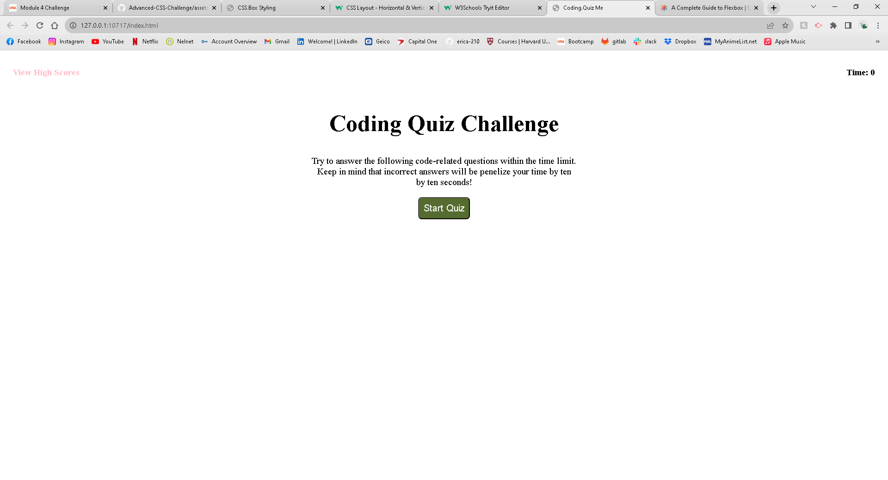

# Coding Quiz

## Description

A simple coding to implement use of API's in JavaScript and test your knowledge on the subject.

## Installation

N/A

## Usage

Coding Quiz webpage: https://erica-210.github.io/coding-quiz/

GitHub Repository: https://github.com/erica-210/coding-quiz

Portfolio: https://erica-210.github.io/Advanced-CSS-Challenge/

Webpage: 

## Credits

Week 4 Activities Content

Pages used as refrences:

    W3 JS: https://www.w3schools.com/js/default.asp

    Guide to Flexbox: https://css-tricks.com/snippets/css/a-guide-to-flexbox/#aa-order

    JS timers: https://www.elated.com/javascript-timers-with-settimeout-and-setinterval/

Tutoring:

    Jill Jiang
    
## License

N/A

